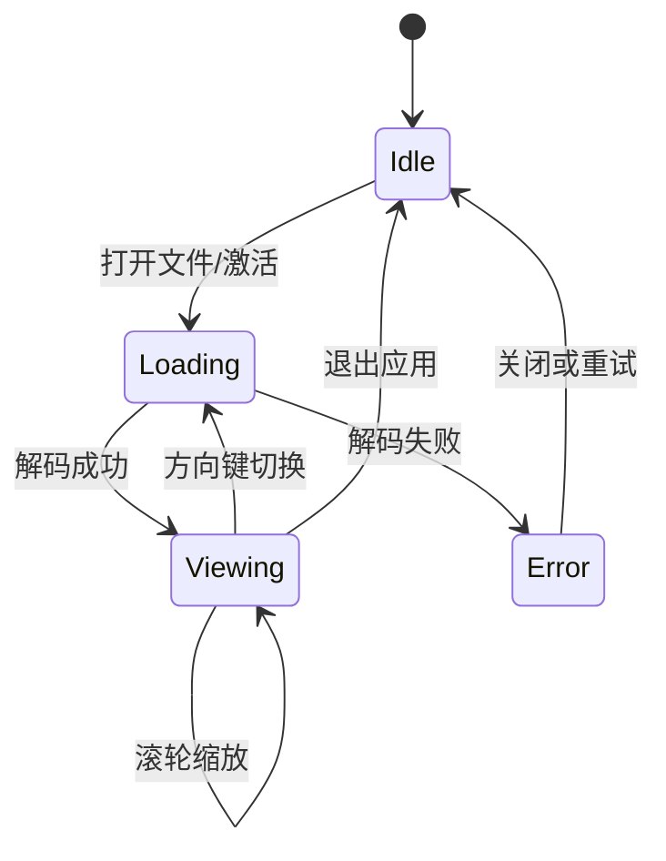

# 数据模型：ProView（Phase 1）

**特性**：`001-proview`  
**关联规格**：[spec.md](./spec.md)

本文档描述应用内的 **概念实体** 与 **状态转换**（无数据库持久化）。

---

## 实体

### 1. `ImageSession`（当前会话）

| 字段 / 概念 | 说明 | 验证 / 约束 |
|-------------|------|-------------|
| `CurrentFile` | 当前展示的 `StorageFile` 引用或路径 | 必须可读；失败时走规格边界条款 |
| `DecodedBitmap` | 当前解码结果（如 `SoftwareBitmap`） | 切换图片时释放上一帧引用 |
| `ViewTransform` | 缩放比例、平移/视口（与 UI 一致） | 缩放须符合锚点规则；重置策略实现定义 |
| `FolderFiles` | 同目录可显示文件的有序列表 | 排序规则在实现中固定（如按名称） |
| `CurrentIndex` | 在 `FolderFiles` 中的索引 | 0…n-1；与方向键、循环一致 |

**关系**：一个 `ImageSession` 在任意时刻对应 0 或 1 个 `DecodedBitmap`；`FolderFiles` 由 `CurrentFile` 所在目录推导。

---

### 2. `FolderListing`（同目录枚举集）

| 字段 / 概念 | 说明 |
|-------------|------|
| `Directory` | 父目录 `StorageFolder` |
| `Entries` | 过滤后的图片文件有序列表 |
| `Filter` | 扩展名或内容类型规则（实现固定） |

**验证**：枚举失败（权限、路径无效）时不崩溃，保持当前会话或空状态并符合规格。

---

## 状态转换（简图）

---

## 与规格编号对应

| 规格 | 模型落点 |
|------|----------|
| FR-003 | `FolderFiles` + `CurrentIndex` + 循环规则 |
| FR-004/005 | `ViewTransform` + 指针锚点（表现层） |
| FR-009 | 无 `FolderListing` 的磁盘持久化；无缓存实体 |
